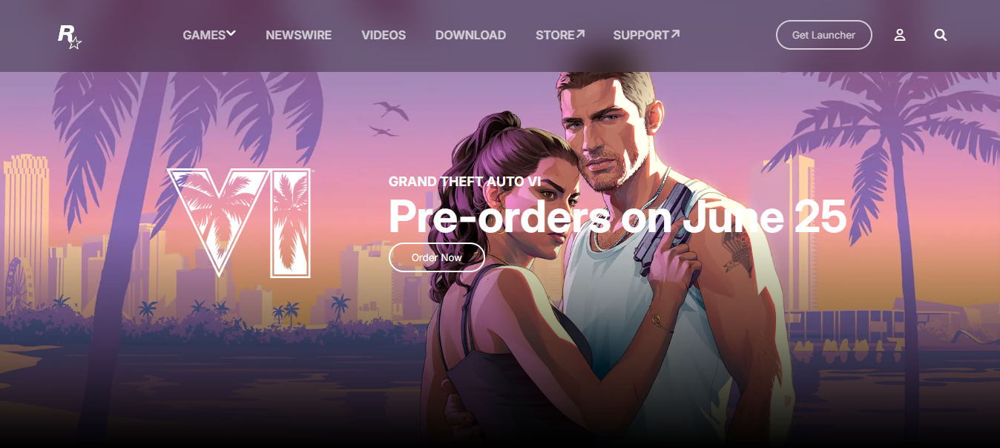

# 🎮 Rockstar Games — Website Clone

A pixel-conscious front-end clone of the official **Rockstar Games** website, built from scratch with vanilla HTML and CSS. The project focuses on recreating the bold, cinematic feel of the original site — full-bleed visuals, a looping video background, smooth animations, and a fully responsive layout.

🔗 **Live Repo:** [github.com/dev-Mustafa07/rockstar-clone](https://github.com/dev-Mustafa07/rockstar-clone)

---

## ✨ Features

- **Hero Section** — Full-screen landing area with a looping background video for a cinematic, game-trailer feel.
- **Animated Infinite Slider** — Smooth, continuously scrolling showcase of games/content.
- **Card-Based Layouts** — Clean, modular cards used to display games and content sections.
- **Hamburger Navigation Menu** — Custom mobile menu with toggle animation.
- **Fully Responsive Design** — Layout adapts across three breakpoints (desktop, tablet, and mobile) for a consistent experience on any screen size.

---

## 🛠️ Built With

- **HTML5** — Semantic page structure
- **CSS3** — Custom styling, animations, flexbox/grid layouts, and media queries

---

## 📁 Project Structure

```
rockstar-clone/
├── images/        # Image assets used across the site
├── videos/         # Background/hero video assets
├── index.html      # Main page markup
├── style.css        # All styling, layout, and responsive rules
└── README.md
```

---

## 🚀 Getting Started

No build tools or dependencies required — it's a static site.

1. **Clone the repository**
   ```bash
   git clone https://github.com/dev-Mustafa07/rockstar-clone.git
   ```
2. **Navigate into the project folder**
   ```bash
   cd rockstar-clone
   ```
3. **Open `index.html`** in your browser — that's it.

---

## 📸 Preview


```md

```

---

## 🧠 What I Learned

This project was a hands-on exercise in:
- Structuring a large, visually heavy landing page with semantic HTML
- Building responsive layouts that hold up across multiple breakpoints
- Implementing CSS-only animations (infinite slider, menu toggle)
- Working with video as a background element without breaking performance or responsiveness

---

## 👤 Author

**Muhammad Mustafa**
GitHub: [@dev-Mustafa07](https://github.com/dev-Mustafa07)

---

## 📄 License

This project is for educational and portfolio purposes. All Rockstar Games branding, names, and assets belong to their respective owners; this clone is not affiliated with or endorsed by Rockstar Games.
